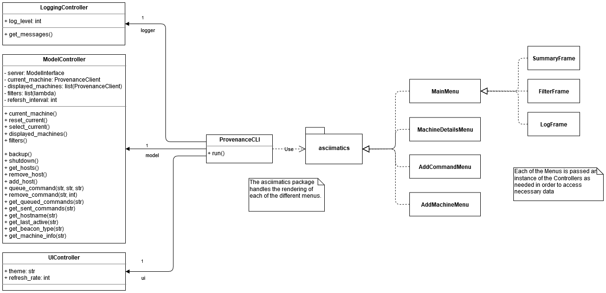

# Provenance Command and Control

Provenance is a Command and Control server used to distribute commands
across different Redteam beacons in order to create a centralized monitoring platform.

#### Purpose
Provenance is personal project used in conjunction with the following beacons in order
to teach myself more about redteaming, malware, evasion and persistence tactics on Windows
and Linux operating systems. Also, I love development :)

| Beacon        | Protocol      | Windows           | Linux     |
| ------------- |:-------------:| ----------------- | --------- |
| resolution    | DNS           | On Hold           | Golang    |
|  ?            | ICMP          | future            | future    |
|  ?            | HTTP          | future            | future    |
> NOTE: All new feature development on beacons is currently in Golang due to ease of development and the desire to learn a new language.

#### Disclaimer
This project and the beacons above are meant to be a Proof of Concept and should not be used in any real-world
environment. They are meant for educational use inside controlled environments such as your own homelab, classes
(where you have permission), or competition environments. Any illegal use of Provenance and it's related beacons
outside strictly controlled environments **IS NOT CONDONED** and is more often than not **ILLEGAL**.
Please be smart and responsible.

## Installation
Provenance supports python3 on both Windows and Linux. More specifically,
it is being developed primarily on 3.7.7

##### Pipenv
```bash
pip install pipenv
pipenv --three
pipenv install
pipenv shell
python3 Provenance.py -h
```

##### Linux
```bash
virutalenv -p python3 c2-env
source c2-env/bin/activate
# Verify it's using the virtiualenv using "which pip3"
pip3 install -r requirements.txt
python3 Provenance.py -h
```

##### Windows
```
python3 -m get-pip.py
pip3 install virtualenv
virtualenv -p python3 c2-env
pip3 install -r requirements.txt
./c2-env/Scripts/python.exe ./Provenance.py -h
```

## Design and Architecture
During development I tried to adhere as best as I could remember to good,
software-engineering design patterns in order to make the code more readable and 
extendable. As such, below will contain as much specificity as possible. 

#### Directory Structure
| Directory     | Description                                                           |
| ------------- | --------------------------------------------------------------------- |
| `backend`     | Server code and `handlers` for different beacons                      |
| `controllers` | Classes that provide an abstraction layer between the model and the UI|
| `frontend`    | Code need to run WebGUI or command line UI                            |
| `backups`     | Default directory where server backups are stored upon creation       |
| `logs`        | Default directory where server logs are stored                        |
| `docs`        | resources for this documentation                                      |

### Backend Architecture


The server architecture attempts to follow Model-View-Controller Design pattern and as such
implements the `ModelController` class which exposes limited functionality to any UI that interacts with it. 
The `ModelController` is instantiated with a concrete class that inherits from the `ModelInterface`
class, which defines standard methods for retrieving information from the server. At this moment,
`ProvenanceServer` or a `ThreadedProvenanceServer` define the functionality of serving C2 commands.

Regardless of the type of server, internally the server stores information about the beaconing machines via
multiple `ProvenanceClient` instances. Each instance will independently track the commands that need to be sent to
it, last callback time, etc. However, this class doesn't define the implementation for actually responding
to requests from beacons.

In order to process each request coming into the server, each `ProvenanceClient` instance must have a valid 
`protocolhandler`, which will properly define the server's response when 
the server receives a request from the specific `ProvenanceClient`'s IP address. From there, the server
will call the `ProvenanceClient`'s `handle()` method, which will call the underlying `protocolhandler`'s
`synchronize()`, `encrypt()` and `respond()` methods. These three methods make up the internal state
machine stored within each instanceof `ProvenanceClient`. However is left up to the implementer to
figure out how to **decode the request**, **figure out the correct response**, and then
**encode the command into the acceptable protocol format** using these methods. The state chart below outlines the expected statechart.


The sequence diagram below depicts the call sequence for the interactions between the `ProvenanceServer` instance
receiving a `request` and its subsequent handling. _NOTE: `ProvenanceServer` is a subclass of Python's
`UDPServer` class which dictates the most of the low-level handling of requests_


### Frontend Architecture
The User Interface for Provenance is broken into two implementations: CLI and GUI, which can be specified at launch
of the program. However, as of right now `v0.1-alpha` only the CLI is being worked on due to the parallel process of
building out beacon and server functionality.

#### Command Line Interface
The command line interface is built on top of a python library [asciimatics](https://github.com/peterbrittain/asciimatics),
a cross-platform [ncurses](https://en.wikipedia.org/wiki/Ncurses) API that provides predefined "building blocks" for
creating CLI programs. The diagram below demonstrates the dissemination of data from the the server to the UI.




When specifying the use of the command line as the UI that Provenance should display to, the Provenance will create a 
`ProvenanceCLI` instance and populates it's three public fields of `model`, `logger`, `ui` which allow the command line 
implementation to access data from the server, information about the logs that are being generated from the server, and
and CLI specific information. Each of these models will be passed to each of the `Menu`'s upon instantiation.

##### CLI Mini Demo


The main menu allows users to view critical information about the machines being managed by Progenance such as
the type of beacon being used, the OS, Hostname, IP address, the last time it beaconed out, and the next command
that is being sent. In order to add a command, users can click the "Add CMD" button that will allow them to specify
various parameters to decide what machines to add commands to.


To view more detailed information about the machine, a user can click on the machine on the main menu, bringing
up the advanced details screen.


